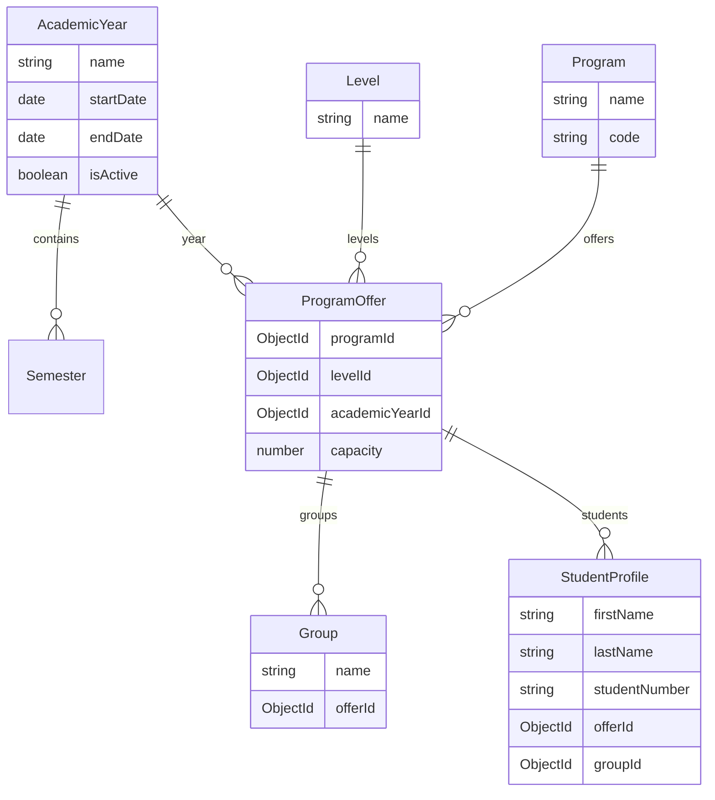
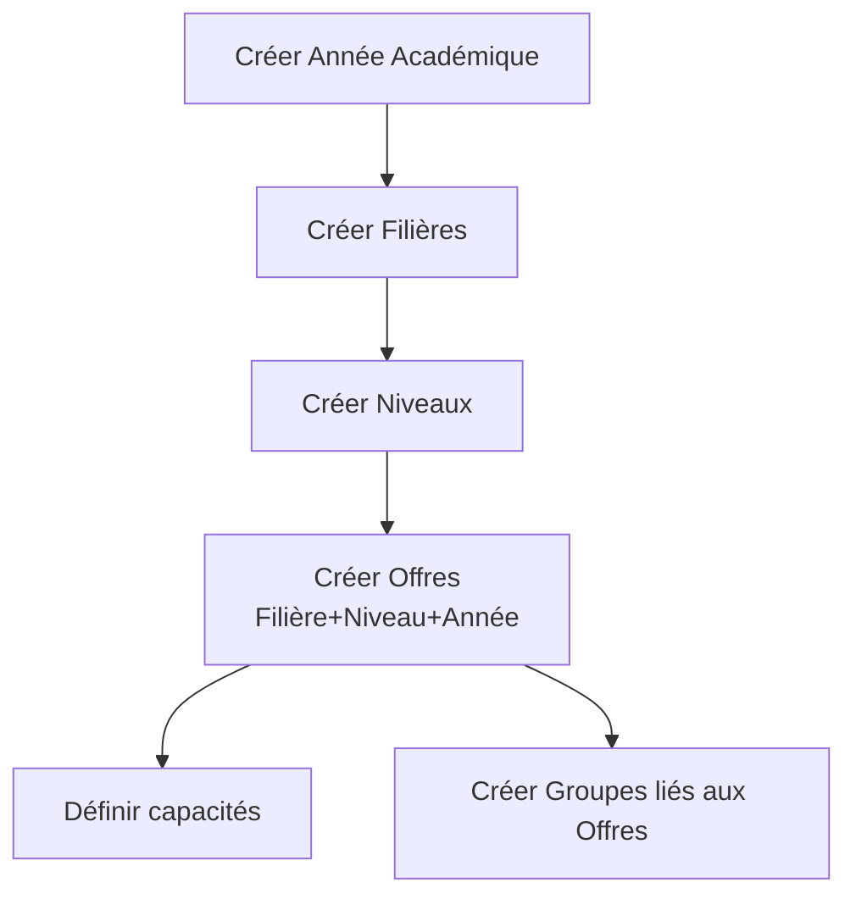
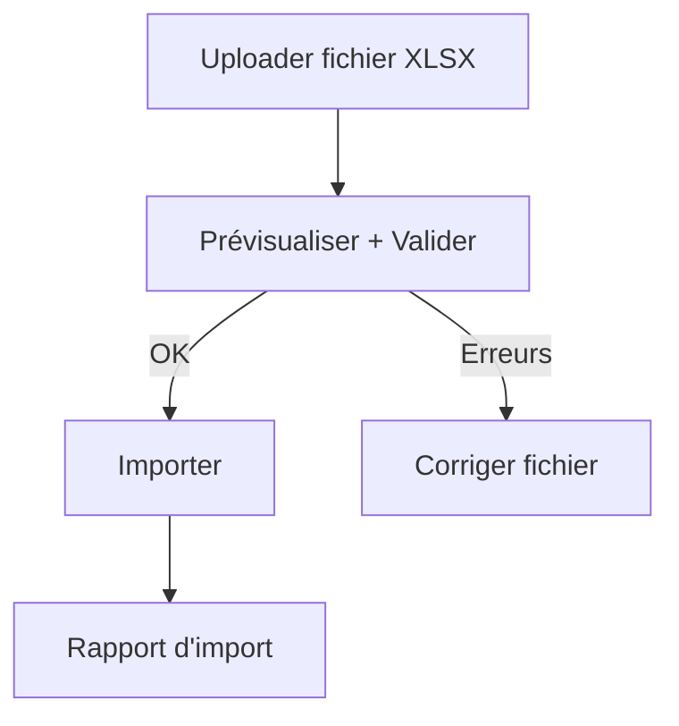

# Cas d’usage administratifs (UC-A01 à UC-A08)

## Portée
Ce document formalise les cas d’usage administratifs V1, avec stories, critères d’acceptation, flux UI, règles RBAC, données, API, tests et DoD.

## Légende priorités
- CRITIQUE
- HAUTE
- MOYENNE

## UC-A01 — Initialisation de l’année (CRITIQUE)
### User Story
En tant qu’admin, je crée une année académique et je configure semestres, filières, niveaux, offres et capacités afin de préparer les inscriptions.

### Critères d’acceptation
- L’année comporte nom, dates début/fin, statut actif.
- Les semestres sont créés et rattachés à l’année.
- Les offres (Filière + Niveau + Année) sont créées avec capacité.
- Les groupes sont créés à partir d’une offre.
- Une seule année active à la fois.

### Flux UI (Admin > Structure)
1. Créer l’année académique.
2. Créer les filières et niveaux.
3. Créer les offres (Filière + Niveau + Année + capacité).
4. Créer les groupes liés aux offres.

### Données
- AcademicYear: name, startDate, endDate, isActive
- Semester: name, startDate, endDate, academicYearId
- Program: name, code
- Level: name
- ProgramOffer: programId, levelId, academicYearId, capacity
- Group: name, offerId

### API (REST)
- `POST /academic/years`, `PATCH /academic/years/:id`, `GET /academic/years`
- `POST /academic/programs`, `PATCH /academic/programs/:id`, `GET /academic/programs`
- `POST /academic/levels`, `PATCH /academic/levels/:id`, `GET /academic/levels`
- `POST /academic/offers`, `PATCH /academic/offers/:id`, `GET /academic/offers`
- `POST /academic/groups`, `PATCH /academic/groups/:id`, `GET /academic/groups`

### RBAC
Roles: Admin, SuperAdmin.

### Tests
- Création année + semestres + offres + groupes.
- Unicité offre (programId+levelId+academicYearId).
- Contrôle de l’année active unique.

---

## UC-A02 — Import des étudiants (CRITIQUE)
### User Story
En tant qu’admin, j’importe en masse la liste des inscrits depuis un fichier Excel afin de créer ou mettre à jour les étudiants.

### Critères d’acceptation
- Import XLSX avec prévisualisation.
- Validation ligne par ligne avec erreurs explicites.
- Rattachement des étudiants à l’offre et au groupe.
- Rapport d’import téléchargeable.

### Flux UI (Admin > Étudiants)
1. Upload fichier.
2. Preview + validation.
3. Import et rapport.

### Données
- StudentProfile: offerId, groupId, academicYearId, info identité.
- ImportLog: fichier, erreurs, statuts.

### API
- `POST /students/import/preview`
- `POST /students/import/commit`
- `GET /students/import/:id`

### RBAC
Roles: Admin, SuperAdmin.

### Tests
- Parsing XLSX, validation colonnes.
- Gestion des erreurs de données.

---

## UC-A03 — Paramétrage des paiements (HAUTE)
### User Story
En tant qu’admin, je configure les frais, tranches et modes de paiement Mobile Money.

### Critères d’acceptation
- Frais définis par année et/ou par offre.
- Échéances et montants validés.
- Modes Mobile Money activables/désactivables.

### Données
- PaymentConfig, InstallmentPlan, PaymentMethod.

### API
- `POST /payments/config`
- `PATCH /payments/config/:id`
- `GET /payments/config`

### RBAC
Roles: Admin, SuperAdmin.

---

## UC-A04 — Gestion des droits (HAUTE)
### User Story
En tant qu’admin, j’attribue ou révoque les droits d’accès d’un utilisateur.

### Critères d’acceptation
- Changement de rôle immédiat.
- Audit log pour toute modification.

### Données
- User, AuditLog.

### API
- `PATCH /users/:id` (role)

### RBAC
Roles: SuperAdmin uniquement pour certains rôles critiques.

---

## UC-A05 — Rapport MESRS (HAUTE)
### User Story
En tant qu’admin, je génère l’état statistique annuel réglementaire.

### Critères d’acceptation
- Export PDF/Excel.
- Données filtrées par année.
- Champs obligatoires conformes MESRS.

---

## UC-A06 — Clôture d’année (HAUTE)
### User Story
En tant qu’admin, je clôture l’année après validation des délibérations.

### Critères d’acceptation
- Bloque les modifications académiques.
- Archive l’année et ses données.
- Génère un rapport de clôture.

---

## UC-A07 — Supervision système (MOYENNE)
### User Story
En tant qu’admin, je consulte les logs, surveille les performances, gère les sauvegardes.

### Critères d’acceptation
- Logs filtrables.
- Indicateurs temps réel ou périodiques.
- Historique des sauvegardes.

---

## UC-A08 — Communication (MOYENNE)
### User Story
En tant qu’admin, je diffuse une annonce officielle à toute la communauté universitaire.

### Critères d’acceptation
- Ciblage par rôle ou global.
- Historique des annonces.
- Accusé de réception optionnel.

---

## Definition of Done (DoD)
- Fonctionnalité conforme aux specs V1.
- Tests unitaires et d’intégration >= 80%.
- Aucune faille critique/majeure.
- Documentation technique et fonctionnelle mise à jour.

---

## Schémas

### Modèle de données (vue simplifiée)

### Flux UC-A01 (Initialisation d’année)

### Flux UC-A02 (Import étudiants)

